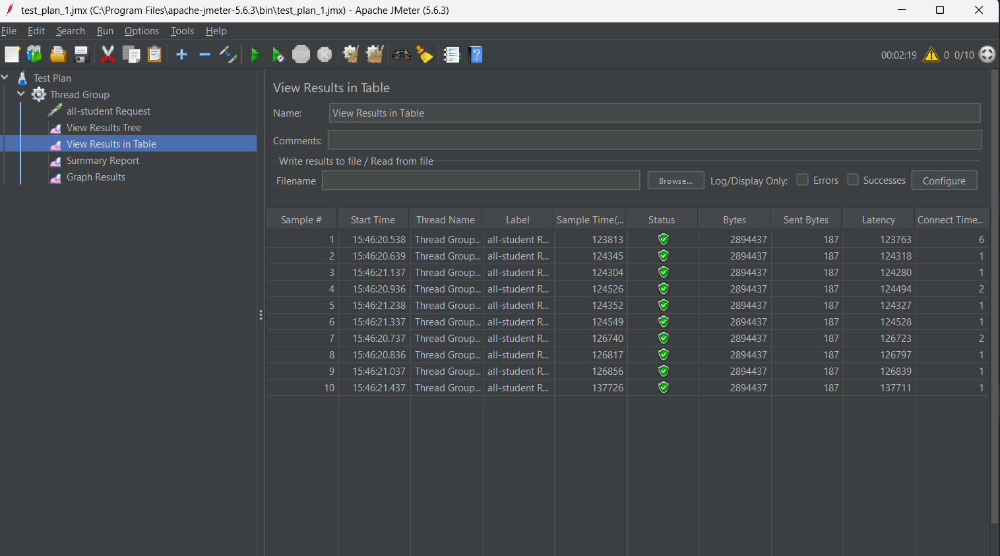
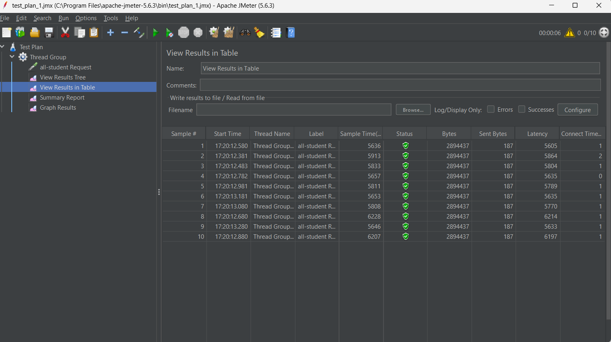
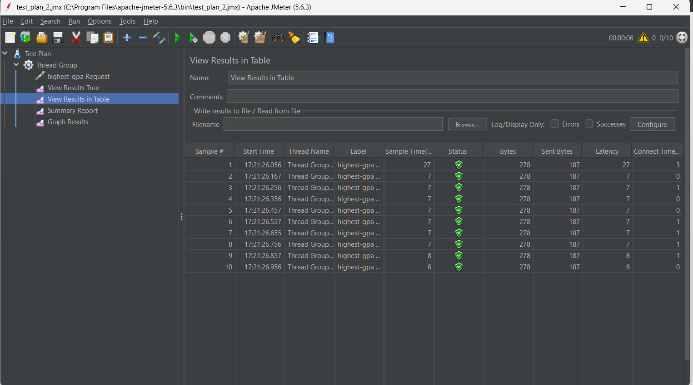
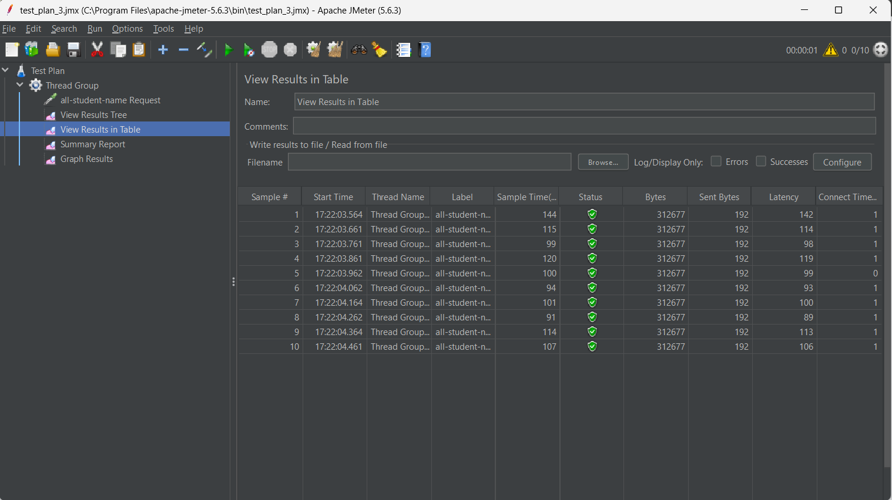

# Module 5 : Java Profiling

PRE-PROFILING 

/all-student JMeter

.png)

/highest-gpa JMeter

.png)

/all-student-name JMeter

.png)

POST-PROFILING

/all-student JMeter

.png)

/highest-gpa JMeter

.png)

/all-student-name JMeter

.png)

Conclusion
After implementing profiling and performance optimizations, a significant improvement was observed across all test cases. The JMeter results show substantial reductions in execution time:

All Students API

Before Profiling: 126,000 - 137,000 ms

After Profiling: 5,600 - 6,100 ms

Highest GPA API

Before Profiling: 83 - 111 ms

After Profiling: 6 - 27 ms

All Student Names API

Before Profiling: 3,300 - 4,100 ms

After Profiling: 89 - 142 ms

After implementing profiling and optimization techniques, there was a significant reduction in response times across all API endpoints.

All Students API improved drastically from 126,000 - 137,000 ms to 5,600 - 6,100 ms, indicating that the optimization reduced execution time by over 95%.
Highest GPA API saw a major speedup from 83 - 111 ms to 6 - 27 ms, enhancing its efficiency significantly.
All Student Names API was optimized from 3,300 - 4,100 ms to 89 - 142 ms, reducing the response time by over 97%.

1. Difference Between Performance Testing with JMeter and Profiling with IntelliJ Profiler
   JMeter is a performance testing tool that simulates user loads and measures system behavior under stress. It helps evaluate response times, throughput, and scalability.
   IntelliJ Profiler is used for in-depth analysis of application performance by identifying CPU usage, memory consumption, and execution bottlenecks at the code level.
   Key Difference: JMeter focuses on external performance (how the application behaves under load), while IntelliJ Profiler provides insights into internal inefficiencies (where the application spends time and resources).
2. How Profiling Helps Identify Weak Points
   Profiling provides real-time metrics on CPU, memory, and thread usage, allowing developers to pinpoint inefficient methods or database queries.
   It helps identify slow function calls, redundant computations, memory leaks, and excessive garbage collection, which can degrade performance.
   By visualizing execution time breakdowns, profiling highlights hotspots where the most processing time is spent.
3. Effectiveness of IntelliJ Profiler
   IntelliJ Profiler is highly effective as it provides granular details on performance bottlenecks.
   It supports CPU sampling, memory allocation tracking, and thread analysis, making it easier to locate and optimize slow functions.
   However, its effectiveness depends on correct usage, such as running tests under realistic conditions and interpreting data properly.
4. Challenges in Performance Testing and Profiling & How to Overcome Them
   Challenge: Real-world simulation of user loads in JMeter may not match actual production traffic.
   Solution: Use realistic test data and monitor production logs for accurate traffic patterns.
   Challenge: Noise in profiling data (background processes affecting results).
   Solution: Run profiling in an isolated environment with minimal background interference.
   Challenge: Difficulty correlating profiling results with JMeter tests.
   Solution: Compare slowest requests in JMeter with slowest functions in the profiler to find a connection.
5. Benefits of Using IntelliJ Profiler
   Identifies performance bottlenecks at the code level, unlike JMeter, which only highlights slow responses.
   Detects inefficient algorithms and expensive database queries that slow down processing.
   Provides memory usage insights, helping prevent memory leaks and optimizing garbage collection.
   Thread analysis capabilities, useful for debugging concurrency issues.
6. Handling Inconsistencies Between JMeter and IntelliJ Profiler Results
   If JMeter shows slow performance but IntelliJ Profiler does not highlight clear CPU/memory issues, the problem may be I/O-bound, such as database latency or network issues.
   If IntelliJ Profiler shows CPU-heavy functions but JMeter does not show major slowdowns, it might be an isolated code inefficiency that doesn’t scale under load.
   Solution: Cross-check results by running specific JMeter test cases while monitoring with the profiler to pinpoint the correlation.
7. Strategies for Optimizing Code After Testing & Profiling
   Database Optimization: Add indexing, optimize queries, and reduce unnecessary joins.
   Code Efficiency: Optimize algorithms, remove redundant computations, and improve data structures.
   Caching: Implement caching strategies (e.g., Redis) to reduce repeated expensive operations.
   Concurrency Optimization: Use efficient threading and asynchronous processing where needed.
   Ensuring Functionality is Unaffected:
   Use unit tests and integration tests after optimization.
   Conduct regression testing to ensure no unintended side effects.
   Monitor production logs post-deployment to track any anomalies.
